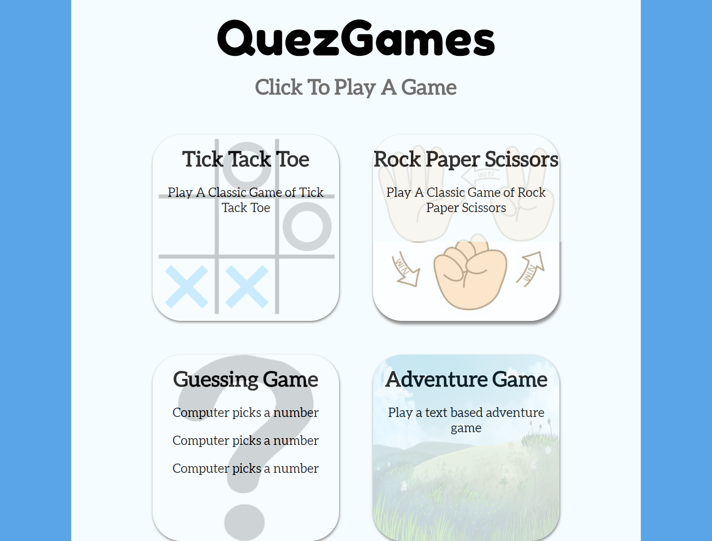
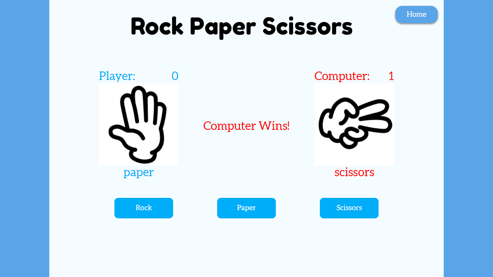
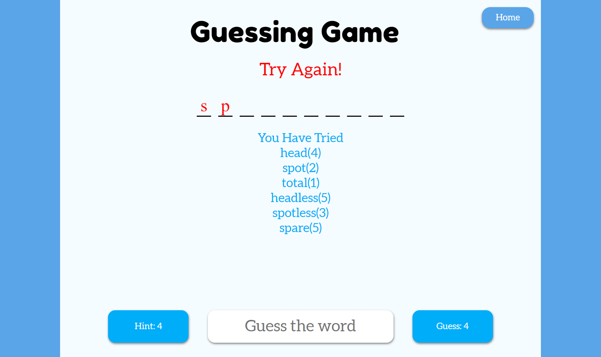
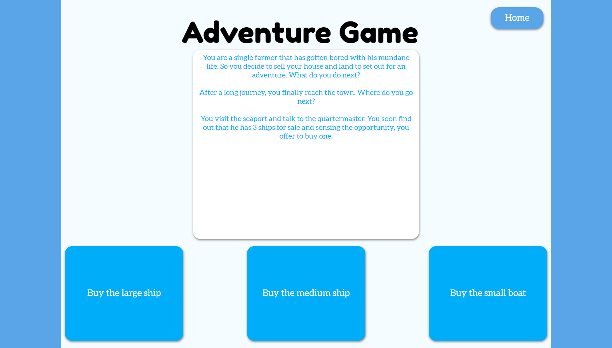

# Quez Games

## Description

> A gaming website which allows you playing some classic games like
>
> 1. Tick Tack Toe
> 1. Rock Paper Scissors
> 1. Word Guessing Game
> 1. A text based Adventure Game

## Technologies

> - React
> - CSS
> - Workbox
> - EsLint

## How to install

To view or edit this project, follow these instructions

```
git clone https://github.com/williamj1788/quezGames
cd quezGames
npm install
npm start
```

The project should show open up in a new tab

If it doesn't, you can view it on localhost 3001

## Pages

> You can view this website [here](https://williamj1788.github.io/quezGames)

### Home



### Tick-Tack-Toe


### Rock-Paper-Scissors



### Guessing Game



### Adventure Game


