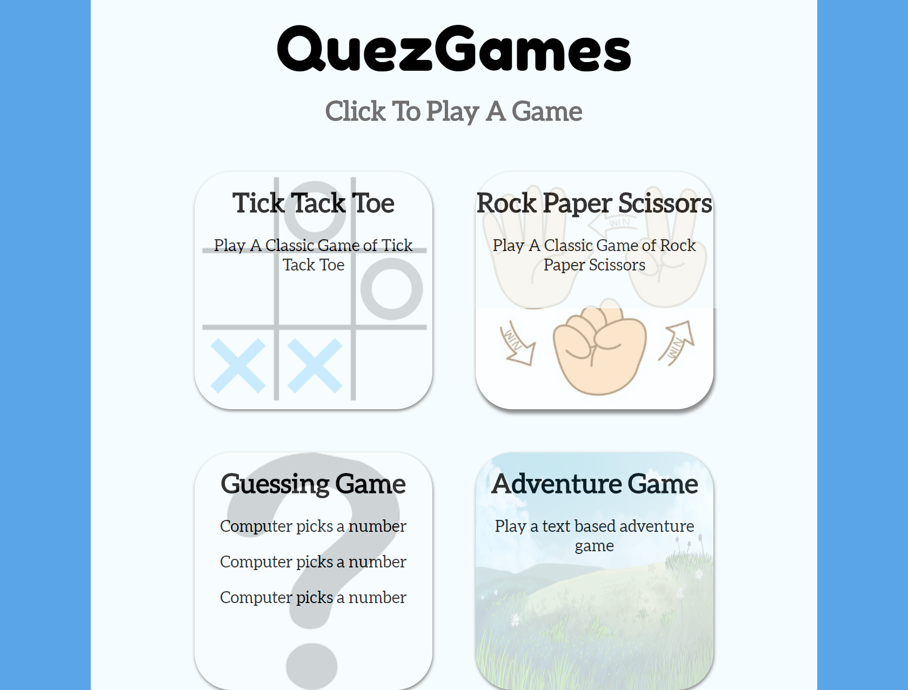
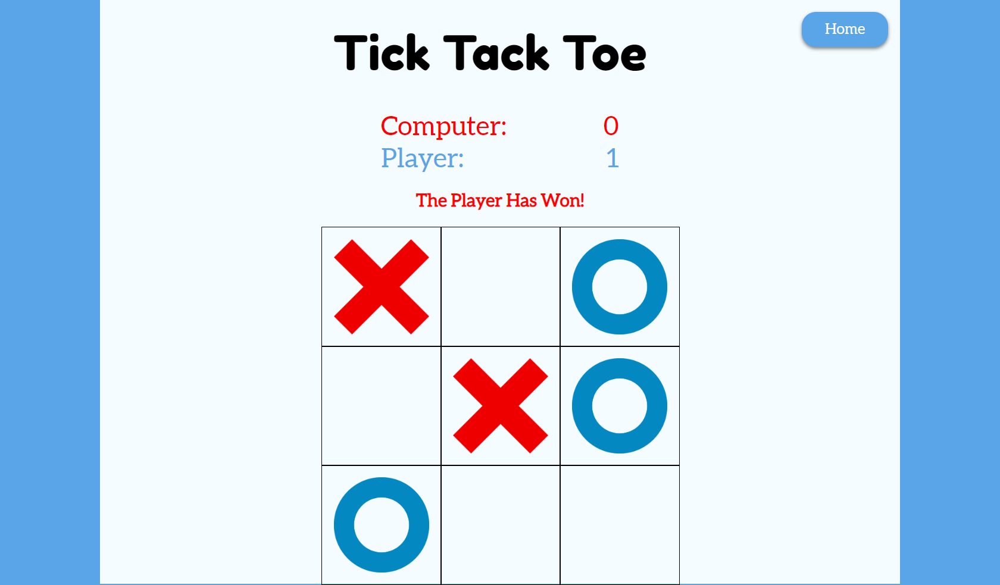
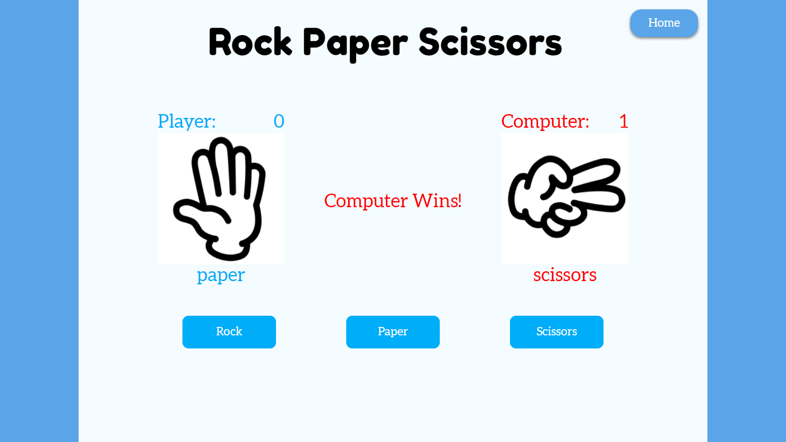
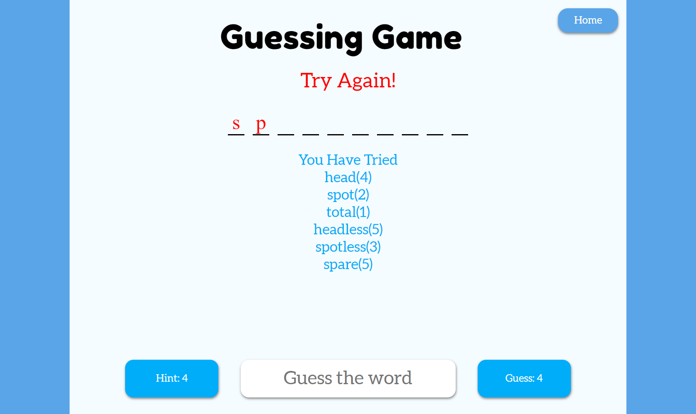
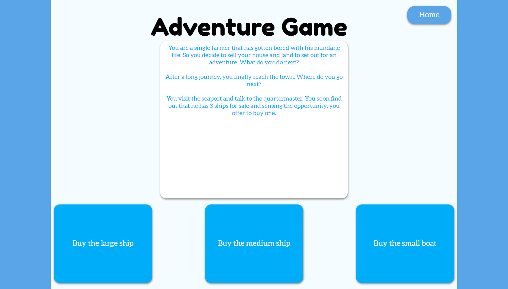

# Quez Games

## Description

> A simple gaming website that I made which allows you playing some basic games like
>
> 1. Tick Tack Toe
> 1. Rock Paper Scissors
> 1. Word Guessing Game
> 1. A text based Adventure Game

## Timeline 

> February 5, 2019 - February 15, 2019
>
> June 20, 2019
> * Edit Text based Adventure Game

## Technology

> * React
> * CSS
> * Word Api

## What I learn

> * Vastly improved React skills
> * connected to a public api

## How to install

To view or edit this project, follow these instructions
```
git clone https://github.com/williamj1788/quezGames
cd quezGames
npm install
npm start
```
The project should show open up in a new tab

If it doesn't, you can view it on localhost 3001

## Pages

> You can view this website [here](https://quezgame.herokuapp.com)

### Home



### Tick-Tack-Toe



### Rock-Paper-Scissors



### Guessing Game



### Adventure Game


